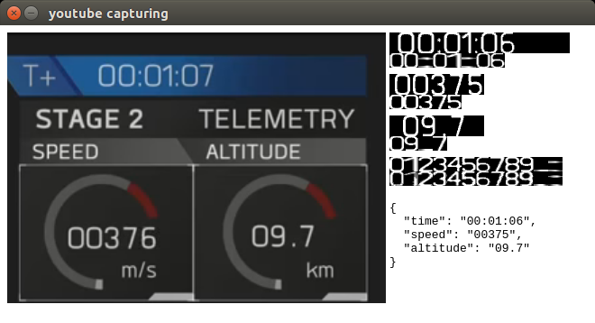

#SpaceX telemetry capturing

An attempt to capture telemetry in realtime from a live video stream

- uses electron js to be able to do desktop capturing
- uses a very crude image overlap calculation to recognize characters

It is not much yet, but it does give some results:

## getting it to run

- clone from github
- `npm install`
- `npm start`

## workings

- play the spacex video in a frame, with a bit of transforms to get the interesting part up close
- use electron to capture the window and feed it back into a video element
- capture that video element to a few canvas elements, slicing out the data bits
- some thresholding to get the individual characters in greyscale
- calculate the similarity with predefined characters and get the best
- use that to guess the character

## doing stuff with the data

The capture tries to send data over a local [mhub-server](https://github.com/poelstra/mhub). To set one up:

- (install nodejs)
- `npm install -g mhub`
- `mhub-server`

This launches an mhub server locally. If you want to see the data coming in, use

- `mhub-client -l -o jsondata`

This will give you a stream of data. With that you could

- pipe it to another utility
- listen to it with websockets
- listen to it with raw tcp sockets

[mhub-output](mhub-output.png)

## improvements / plans

- better character segmentation (it is currently not properly segmented when the video resolution is low)
- better character recognition, we may use a somewhat smarter algorithm, but it needs to be fast.
- more user friendly ui.